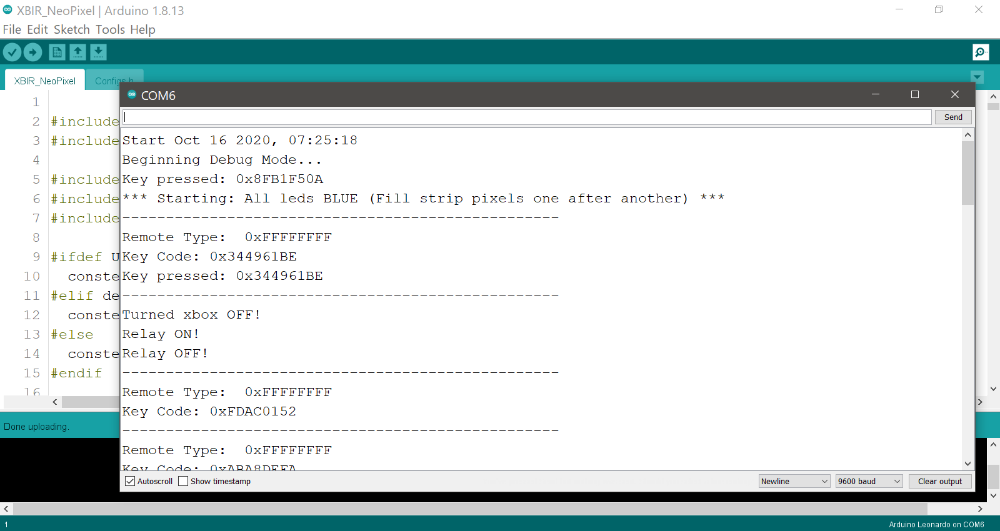

# XBIR NeoPixel
<p align="center">
  
  
</p>

<p align="center">
  <a href="LICENSE"></a>
  <a href="http://hits.dwyl.com/PatFrost/XBIR_NeoPixel"></a>
  <a href="https://github.com/PatFrost/XBIR_NeoPixel/pulls"></a>
  <a href="https://github.com/PatFrost/XBIR_NeoPixel/issues"></a>
  <a href="https://github.com/PatFrost/XBIR_NeoPixel/issues"></a>
</p>


## What is it?
XBIR NeoPixel is for controlling NeoPixel Ring and/or Strip with Xbox DVD Movie Playback Kit.
It's for the original Xbox, but for other project with modification.


## Features!
  - Xbox Power ON/OFF
  - Fully controlling of the NeoPixel
  - Possible to add multiple NeoPixels [(See example)](./resources/images/multiple.jpg)
  - Custom Remote Control


### Parts list
| Part | Qty | Shops |
| ---- | :----: | ----- |
| Arduino Pro Micro Leonardo **5V/16Mhz** | **1** | [Any clones will work](https://www.amazon.com/s?k=Arduino+Pro+Micro+Leonardo+5V%2F16Mhz&ref=nb_sb_noss)<br>Make sure they're the **5V/16Mhz** variant. |
| NeoPixel Ring - 24 x 5050 RGB LED with Integrated Drivers **5V** | **∞** | [Any will work](https://www.adafruit.com/product/1586)<br>I recommend with Integrated Drivers.<br>Make sure they're the **5V** variant. |
| Relay Module 1-Channel High Level Trigger **5V** | **1** | [Any will work](https://www.amazon.com/s?k=5V+Relay+Module+1+Channel&s=price-asc-rank&qid=1602760350&ref=sr_st_price-asc-rank)<br>Make sure they're the **5V** variant. |
| IR (Infrared) Receiver Sensor | **1** | [TSOP 1556](https://xboxdevwiki.net/Xbox_DVD_Movie_Playback_Kit#Components)<br>Or any other IR (Just check pinout) |
| Remote Control | **1** | [Xbox DVD Movie Playback Kit](https://xboxdevwiki.net/Xbox_DVD_Movie_Playback_Kit)<br>Or any other Remote |
| Resistor **330Ω** | **4** |[Any Resistor 330Ω](https://www.amazon.com/BOJACK-Single-Resistor-Resistors-200pcs/dp/B07R321RJH/ref=sr_1_4?dchild=1&keywords=Resistor+330%E2%84%A6&qid=1602698290&sr=8-4) <br>Or any resistor in series with total values **330Ω** |
| Resistor **10kΩ** | **2** |[Any Resistor 10kΩ](https://www.amazon.com/BOJACK-Single-Resistor-Resistors-200pcs/dp/B07PGHP69F/ref=sr_1_8?dchild=1&keywords=Resistor+10k%E2%84%A6&qid=1602341361&sr=8-8) <br>Or any resistor in series with total values **10kΩ** |
| Capacitor **1000uf** | **1** | [Any Capacitor](https://www.amazon.com/s?k=Capacitor+1000uf&ref=nb_sb_noss) |
| Some Wires | **∞** | [Any wires](https://www.amazon.com/s?k=wires+26+AWG&ref=nb_sb_noss) |


### Software Installation
XBIR NeoPixel uses the open-source Arduino Software (IDE):
  - [Download the Arduino IDE](https://www.arduino.cc/en/Main/Software#download) And install it!

**Adafruit_NeoPixel Library & IRremote Library**
Open the IDE and click to the "Sketch" menu and then Include Library > [Manage Libraries.](https://www.arduino.cc/en/guide/libraries#toc3)
1. In `Filter your search...` enter `Adafruit_NeoPixel` install it or update it.
2. In `Filter your search...` enter `IRremote` install it or update it.
3. In `Type` select `updatable` and update all libraries which would appear.

**XBIR_NeoPixel Library**
  - [Clone this repository to your PC](https://github.com/PatFrost/XBIR_NeoPixel.git)
  - [Or Download Zip](https://github.com/PatFrost/XBIR_NeoPixel/archive/master.zip)
    <br>Extract to `XBIR_NeoPixel` or rename `XBIR_NeoPixel-master` to `XBIR_NeoPixel`


### Programming
1. **open `/XBIR_NeoPixel/Configs.h` with editor and edit what you want**<br>
    In Arduino IDE `Configs.h` appear after opening `XBIR_NeoPixel.ino`<br>
    You can edit:
      - NUM_PIXELS (Number of NeoPixels on Ring and/or Strip)
      - PIXEL_TYPE (The order of primary colors in the NeoPixel data stream can vary among device types, manufacturers and even different revisions of the same item)
      - USE_ORIGINAL (if you want to use xbox original dvd remote)
      - USE_CUSTOM (if you want to use a custom remote control) [See: Custom Remote Control](#custom-remote-control)
      - SETTINGS (General settings)

2. **Program Pro Micro, open `/XBIR_NeoPixel/XBIR_NeoPixel.ino` with Arduino IDE.**<br>
3. **Set the Board Type the Arduino Leonardo and the port correctly.**
    <br><br>
    
    <br><br><br>
4. **Compile by clicking the tick in the top left.**<br>
    Check the console output it has compiled successfully
5. **Connect a Micro USB cable between the Pro Micro and the PC.**
6. **Click the upload button and confirm successful.**
7. **Disconnect Pro Micro**


### Hardware Installation
#### Xbox Connection
<br><br>

<br><br><br>
#### PC Connection
<br><br>

<br><br><br>
****


### Custom Remote Control
[Use PC Connection for this](#pc-connection) or [connect only TSOP on Pro Micro](./resources/images/debugTsop.jpg)
1. **Enable Debug Mode, open `/XBIR_NeoPixel/resources/lib/Log.h` with editor**<br>
    Uncomment below to enable debug output and save file.
    ```c++
    // #define DEBUG_MODE
    ```
    for
    ```c++
    #define DEBUG_MODE
    ```
2. **Program Pro Micro, open `/XBIR_NeoPixel/XBIR_NeoPixel.ino` with Arduino IDE.**
3. **Compile by clicking the tick in the top left.**<br>
    Check the console output it has compiled successfully
4. **Connect a Micro USB cable between the Pro Micro and the PC.**
5. **Click the upload button and confirm successful.**
6. **Open console output by clicking the magnifying glass in the top right.**
7. **Press any key on your remote and look your codes in console.**
    <br><br>
    
    <br><br><br>
8. **Open `/XBIR_NeoPixel/resources/lib/XBIRRemote.h` with editor.**<br>
    Edit CUSTOM section with your new codes
9. **Save `/XBIR_NeoPixel/resources/lib/XBIRRemote.h`**<br>
10. **Comment DEBUG_MODE to disable debug output in `/XBIR_NeoPixel/resources/lib/Log.h` and save file.**
    ```c++
    // #define DEBUG_MODE
    ```
11. **Enable USE_CUSTOM in `/XBIR_NeoPixel/Configs.h` and save file.**
12. **Finally, program again your Pro Micro.**


### Development
Want to contribute? Great!<br>
[Open pull requests](https://github.com/PatFrost/XBIR_NeoPixel/pulls)


### Legal
This article is intended to provide general information.<br>
Please always read and follow the labels/instructions that accompany your products.<br>
I cannot be held responsible for any injuries or damages caused by this activity.

<br><br>
**Cheers!!!**
